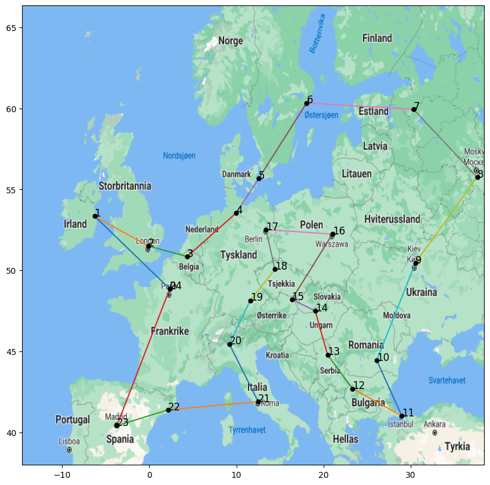

# Traveling salesman problem 
The Traveling Salesman Problem (TSP) is a classic optimization problem, where the goal is to find the shortest possible route that visits each city exactly once and returns to the starting point. As part of the mandatory assignment for the **IN4050 master’s course**, three different algorithms are implemented and compared: 
- Exhaustive Search
- Hill Climbing
- Genetic Algorithm

The project evaluates these algorithms on datasets of varying sizes (6, 10, and 24 cities) and measures the efficiency and accuracy of each approach in finding the optimal route.

## Results for 6 Cities

| Algorithm           | Best Route Distance | Time Taken |
|---------------------|---------------------|----------------|
| Exhaustive Search    | 5018.809          | 0.003         |
| Hill Climbing        | 7486.31          | 1s       |

## Results for 10 Cities

| Algorithm           | Best Route Distance | Time Taken |
|---------------------|---------------------|----------------|
| Exhaustive Search    | 7486.309            | 13.47s        |
| Hill Climbing        | 11434.41            |  2.9s        |
| Genetic Algorithm    | 7486.309         | 1.9        |

The following was the **Genetic Algorithm Configuration**: 

| Parameter          | Value         |
|--------------------|---------------|
| Population Size     | 200           |
| Generations         | 200           |
| Mutation Rate       | 0.20 (20%)     |
| Selection Method    | Roulette Selection |
| Elitism             | Yes (Top 10%)  |
| Crossover Operator  | Edge Recombination |
| Mutation Operator   | Swap Mutation |

## Results for 24 Cities

| Algorithm           | Best Route Distance | Time Taken |
|---------------------|---------------------|----------------|
| Exhaustive Search    | NaN          | Inf      |
| Hill Climbing        | 13563.21     |      3.6s   |
| Genetic Algorithm    | 12384.22         |  2m, 10s  (per run)    |

The following was the **Genetic Algorithm Configuration**: 

| Parameter          | Value         |
|--------------------|---------------|
| Population Size     | 500           |
| Generations         | 1000          |
| Mutation Rate       | 0.20 (20%)     |
| Selection Method    | Roulette Selection |
| Elitism             | Yes (Top 10%)  |
| Crossover Operator  | Edge Recombination |
| Mutation Operator   | Swap Mutation |