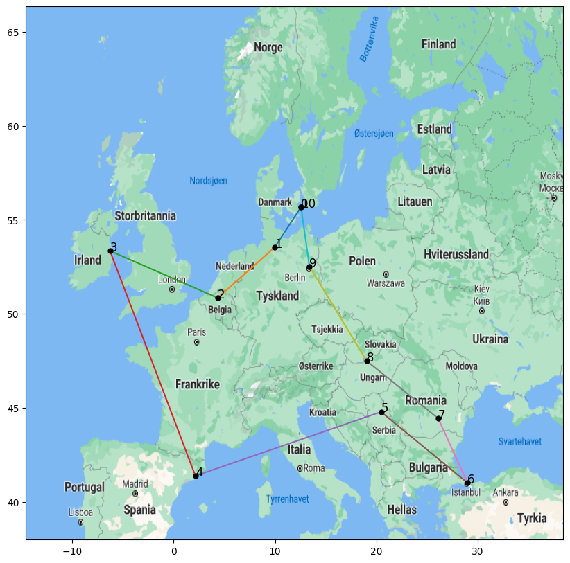

# Traveling salesman problem 
Traveling salesman problem solved. Mandatory assignment for the master course, IN4050.

## Results for 6 Cities

| Algorithm           | Best Route Distance | Time Taken (s) |
|---------------------|---------------------|----------------|
| Exhaustive Search    | [Distance]          | [Time]         |
| Hill Climbing        | [Distance]          | [Time]         |
| Genetic Algorithm    | [Distance]          | [Time]         |

The following was the **Genetic Algorithm Configuration**: 

| Parameter          | Value         |
|--------------------|---------------|
| Population Size     | 200           |
| Generations         | 100           |
| Mutation Rate       | 0.05 (5%)     |
| Crossover Rate      | 0.8 (80%)     |
| Selection Method    | Roulette Selection |
| Elitism             | Yes (Top 5%)  |
| Crossover Operator  | Edge Recombination |
| Mutation Operator   | Swap Mutation |

## Results for 20 Cities

| Algorithm           | Best Route Distance | Time Taken (s) |
|---------------------|---------------------|----------------|
| Exhaustive Search    | [Distance]          | [Time]         |
| Hill Climbing        | [Distance]          | [Time]         |
| Genetic Algorithm    | [Distance]          | [Time]         |

The following was the **Genetic Algorithm Configuration**: 

| Parameter          | Value         |
|--------------------|---------------|
| Population Size     | 200           |
| Generations         | 100           |
| Mutation Rate       | 0.05 (5%)     |
| Crossover Rate      | 0.8 (80%)     |
| Selection Method    | Roulette Selection |
| Elitism             | Yes (Top 5%)  |
| Crossover Operator  | Edge Recombination |
| Mutation Operator   | Swap Mutation |

## Results for 24 Cities

| Algorithm           | Best Route Distance | Time Taken (s) |
|---------------------|---------------------|----------------|
| Exhaustive Search    | [Distance]          | [Time]         |
| Hill Climbing        | [Distance]          | [Time]         |
| Genetic Algorithm    | [Distance]          | [Time]         |

The following was the **Genetic Algorithm Configuration**: 

| Parameter          | Value         |
|--------------------|---------------|
| Population Size     | 200           |
| Generations         | 100           |
| Mutation Rate       | 0.05 (5%)     |
| Crossover Rate      | 0.8 (80%)     |
| Selection Method    | Roulette Selection |
| Elitism             | Yes (Top 5%)  |
| Crossover Operator  | Edge Recombination |
| Mutation Operator   | Swap Mutation |